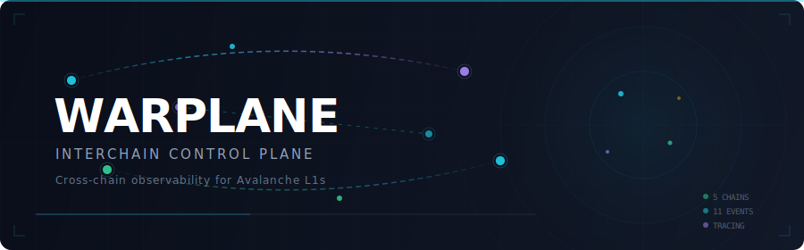

<p align="center">
  
</p>

<p align="center">
  <strong>Unified observability and cross-chain message tracing for Avalanche L1 subnet operators.</strong><br/>
  Captures the full lifecycle of Teleporter messages — from send through relay, delivery, retry, and replay protection — and surfaces them through a REST API, web dashboard, and CLI.
</p>

<p align="center">
  <a href="docs/planning/roadmap.md">Roadmap</a> &middot;
  <a href="docs/runbooks/api.md">API Docs</a> &middot;
  <a href="CONTRIBUTING.md">Contributing</a> &middot;
  <a href="docs/decisions/README.md">ADRs</a>
</p>

---

## What Warplane Does

- **Trace Teleporter messages** across L1 chains with a canonical 11-event lifecycle model
- **Visualize cross-chain activity** through an interactive web dashboard with per-message lifecycle timelines
- **Monitor relayer health** with real-time health status, failure classification, and delivery latency percentiles
- **Ingest live chain data** via RPC polling, WebSocket subscriptions, and Prometheus metrics scraping
- **Query traces programmatically** via REST API with OpenAPI 3.1 documentation
- **Run deterministic test scenarios** covering success, failure, retry, fee addition, and replay protection
- **Validate message flows** against typed Zod schemas with generated JSON Schema and OpenAPI specs

## 5-Minute Quickstart

Prerequisites: Node >= 20, pnpm >= 10.

```bash
git clone <repo-url> && cd warplane
pnpm install
pnpm demo:seed
```

This builds all packages, seeds the database with 8 golden Teleporter traces across 5 scenarios, and starts both the API and web dashboard:

| Service      | URL                                |
| ------------ | ---------------------------------- |
| Dashboard    | http://localhost:5173              |
| Relayer Ops  | http://localhost:5173/relayer      |
| API          | http://localhost:3100              |
| Swagger UI   | http://localhost:3100/docs         |
| OpenAPI spec | http://localhost:3100/openapi.json |
| Health check | http://localhost:3100/health       |

Try the CLI (in a separate terminal):

```bash
pnpm -F @warplane/cli build
npx warplane doctor
npx warplane traces list
npx warplane --json scenarios list
```

## Seeded Mode vs. Full E2E Mode

|                 | Seeded (default)                               | Full E2E                                                   |
| --------------- | ---------------------------------------------- | ---------------------------------------------------------- |
| **Setup**       | `pnpm demo:seed`                               | See [docs/runbooks/full-e2e.md](docs/runbooks/full-e2e.md) |
| **Requires**    | Node + pnpm                                    | Node + pnpm + Go + AvalancheGo + subnet-evm                |
| **Data source** | Golden fixtures in `harness/tmpnet/artifacts/` | Live Avalanche temporary network                           |
| **Use case**    | Development, demos, CI                         | Integration testing, pre-release validation                |

## Teleporter Scenarios

The golden fixture dataset covers five deterministic Teleporter scenarios:

| Scenario                      | What It Tests                                      | Status         |
| ----------------------------- | -------------------------------------------------- | -------------- |
| `basic_send_receive`          | Full happy-path message lifecycle                  | success        |
| `add_fee`                     | Fee addition via `AddFeeAmount`                    | success        |
| `specified_receipts`          | Batch receipt delivery via `SendSpecifiedReceipts` | success        |
| `retry_failed_execution`      | Execution failure with successful retry            | retry_success  |
| `replay_or_duplicate_blocked` | Duplicate message rejection                        | replay_blocked |

## Repo Layout

```
apps/
  api/          Fastify REST API server (@warplane/api)
  web/          React + Vite dashboard with relayer ops (@warplane/web)
  docs/         VitePress documentation site (@warplane/docs-site)
packages/
  domain/       Core types and Zod schemas (@warplane/domain)
  storage/      SQLite + Postgres persistence layer (@warplane/storage)
  ingest/       RPC, WebSocket, and Prometheus ingestion pipeline (@warplane/ingest)
  cli/          CLI tool (@warplane/cli)
  docs-mcp/     MCP server for docs (@warplane/docs-mcp)
harness/
  tmpnet/       Go test harness for Avalanche tmpnet E2E
docs/
  planning/     Roadmap, work items, status, risk register
  decisions/    Architecture Decision Records (MADR)
  product/      Product overview
  runbooks/     Operational guides
  ai/           AI-facing docs, context map, prompting guide
```

## Scripts

| Command               | Description                                         |
| --------------------- | --------------------------------------------------- |
| `pnpm demo:seed`      | Start API + web with seeded golden fixtures         |
| `pnpm run repo:check` | Full CI check suite (build, lint, test, docs, ADRs) |
| `pnpm dev`            | Start the API server in dev mode                    |
| `pnpm dev:web`        | Start the web dashboard in dev mode                 |
| `pnpm build`          | Build all packages                                  |
| `pnpm test`           | Run all unit tests                                  |
| `pnpm run check`      | Lint + typecheck                                    |
| `pnpm docs:dev`       | Start docs site locally                             |
| `pnpm docs:build`     | Build static docs site                              |
| `pnpm docs:llms`      | Generate llms.txt and LLM context files             |
| `pnpm mcp:docs`       | Start the docs MCP server                           |
| `make e2e`            | Full E2E with real tmpnet (requires AvalancheGo)    |

## CI

CI runs automatically on push to `main` and on pull requests:

- **[CI](.github/workflows/ci.yml)**: Build, lint, typecheck, format, unit tests, API integration smoke test, CLI smoke test, docs build, llms generation check, ADR validation
- **[Go Harness](.github/workflows/ci.yml)**: Go build, vet, and unit tests (parallel)
- **[E2E Tmpnet](.github/workflows/e2e-tmpnet.yml)**: Full tmpnet E2E (manual dispatch — requires AvalancheGo binaries)
- **[ADR Validation](.github/workflows/adr-validation.yml)**: Validates ADR structure on changes to `docs/decisions/`

## Documentation

| Resource                                              | Description                 |
| ----------------------------------------------------- | --------------------------- |
| [Product overview](docs/product/one-pager.md)         | What Warplane is and why    |
| [Roadmap](docs/planning/roadmap.md)                   | Milestone breakdown         |
| [Architecture decisions](docs/decisions/README.md)    | ADR log                     |
| [Trace model](docs/runbooks/trace-model.md)           | Teleporter event lifecycle  |
| [Full E2E guide](docs/runbooks/full-e2e.md)           | Running with live Avalanche |
| [Storage runbook](docs/runbooks/storage.md)           | Database and ingestion      |
| [API runbook](docs/runbooks/api.md)                   | API endpoints and usage     |
| [Milestone 2 plan](docs/planning/milestone-2-plan.md) | M2 implementation stages    |
| [Contributing](CONTRIBUTING.md)                       | How to contribute           |

## Current Status

**Milestone 1** is complete (monorepo, domain model, storage, API, web dashboard, CLI, harness, CI).

**Milestone 2** is in progress — Stages 1–5 of 8 complete:

- Stage 1: RPC ingestion engine with block tracking and log decoding
- Stage 2: Event normalization pipeline with cross-chain message correlation
- Stage 3: Prometheus metrics integration (relayer + signature aggregator health)
- Stage 4: Storage evolution with async DatabaseAdapter and Postgres compatibility
- Stage 5: Per-message tracing UI, relayer ops dashboard, and stats API

Remaining: Stage 6 (webhooks), Stage 7 (Docker Compose + Fuji deployment), Stage 8 (E2E hardening).

## License

Apache-2.0 — see [LICENSE](LICENSE).
